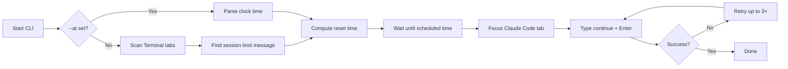

# claude-code-continue

**Automatically send `continue` in Claude Code (Terminal.app) when your session limit resets.**

A macOS CLI that scans open **Terminal.app** tabs for Claude Code's session-limit message, waits until the reset time, then types `continue` and presses Enter—so you do not have to babysit the reset clock.

```bash
claude-code-continue watch    # detect limit → wait → type continue
claude-code-continue detect     # print reset time only

# Short alias:
ccc watch
ccc detect
```

Related: [claude-continue](https://github.com/hamza-siddiq/claude-continue) does the same for **Claude Desktop**.

---

## Table of contents

- [How it works](#how-it-works)
- [Requirements](#requirements)
- [Install](#install)
- [Permissions](#permissions)
- [Usage](#usage)
- [Scheduling logic](#scheduling-logic)
- [Sleep and power](#sleep-and-power)
- [Troubleshooting](#troubleshooting)
- [Limitations](#limitations)
- [Development](#development)
- [License](#license)

---

## How it works



1. **Detect** — Scan every Terminal.app tab's scrollback for a session-limit line like:
   ```text
   You've hit your session limit · resets 2:28pm (Asia/Karachi)
   ```
2. **Schedule** — Parse the reset clock time (with timezone) and wait until that moment.
3. **Continue** — Focus the matching tab and send `continue` + Return at the `>` prompt.

For long waits, the tool schedules a macOS wake event and uses `caffeinate` in the final minutes so the Mac does not idle-sleep through the reset.

---

## Requirements

| Requirement | Details |
|-------------|---------|
| **OS** | macOS 13 (Ventura) or later |
| **Python** | 3.10+ |
| **Terminal** | [Terminal.app](https://support.apple.com/guide/terminal/welcome/mac) with Claude Code running in a tab |
| **Permissions** | **Accessibility** for the terminal running this tool; **Automation** to control Terminal.app |

---

## Install

```bash
git clone https://github.com/hamza-siddiq/claude-code-continue.git
cd claude-code-continue

python3 -m venv .venv
source .venv/bin/activate
pip install -e .
```

Verify:

```bash
claude-code-continue --version
ccc --help
```

---

## Permissions

1. **System Settings → Privacy & Security → Accessibility** — enable the terminal app you use to run this tool (Terminal, iTerm, Cursor, etc.).
2. **System Settings → Privacy & Security → Automation** — allow that app to control **Terminal**.

Without Accessibility, System Events cannot send keystrokes. Without Automation, the tool cannot read Terminal tab scrollback.

---

## Usage

### Typical workflow

1. Claude Code hits a session limit in a Terminal tab — leave that tab open at the `>` prompt.
2. In **another** terminal tab or window, run:
   ```bash
   claude-code-continue watch
   ```
3. The tool finds the limited tab, waits until the reset time, switches to that tab, and types `continue`.

If more than one tab shows a session-limit message, `ccc watch` asks which reset time to use. It then lists every Claude Code tab so you can choose where to send `continue` — the tab where the limit appeared is always option 1, even if another Claude Code tab never showed the limit message. Run `ccc detect` first to preview active limits.

**Tip:** Run `ccc watch` from a **different** Terminal tab (or iTerm/Cursor) than the one running Claude Code. If keystrokes land in your shell instead of Claude Code, you may see `continue: not in while, until, select, or repeat loop` — that means the wrong tab received the input.

### Commands

```bash
# Auto-detect limit from Terminal tabs, wait, then continue
claude-code-continue watch
ccc watch

# List every limited tab and when each resets
claude-code-continue detect

# Manual reset time (still needs a detectable tab for typing)
claude-code-continue watch --at 2:28pm

# Re-scan every 30s until a limit message appears
claude-code-continue watch --poll 30

# Allow the Mac to sleep during a long wait
claude-code-continue watch --allow-sleep
```

### Scheduling logic

| Source | When `continue` is sent |
|--------|-------------------------|
| Terminal message | At the parsed reset clock time (e.g. `resets 2:28pm (Asia/Karachi)`) |
| `--at TIME` | At the next occurrence of that local clock time |

Timezone in the limit message (e.g. `Asia/Karachi`) is respected. If the reset time has already passed today, the tool schedules for tomorrow.

---

## Sleep and power

- **≥ 5 minutes away:** tries `pmset schedule wakeorpoweron` ~3 minutes before the reset.
- **Wake fails (default):** falls back to `caffeinate` so the Mac stays awake.
- **Final 3 minutes:** polls every 0.25s and keeps the system awake.
- **`--allow-sleep`:** Mac may sleep; the process resumes when something wakes it.

Keep the terminal session alive for long waits — use `nohup` or leave the lid open if a reset is critical.

---

## Troubleshooting

| Problem | Fix |
|---------|-----|
| No session limit found | Run `watch` soon after the limit appears, before scrollback scrolls away. Use `--poll` if starting early. Only tabs **currently** at a limit are matched; older limit text still in scrollback is ignored. |
| Keystrokes do nothing | Grant Accessibility + Automation permissions. |
| Wrong tab selected | `watch` lists all Claude Code tabs for continue; the limit-detected tab is option 1. |
| Multiple limits, non-interactive run | `watch` via `nohup` or a pipe cannot prompt; run it in an interactive terminal to choose a tab. |
| AppleScript error | Ensure Terminal.app is running and the Claude Code tab is still open. |

---

## Limitations

- **Terminal.app only** — iTerm2, Cursor, and Warp are not supported yet.
- **Session limits only** — parses the `You've hit your session limit` message; other limit formats are not handled.
- **Scrollback dependency** — the limit message must still be visible in the tab's scrollback buffer.
- **macOS only** — uses AppleScript and `pmset`/`caffeinate`.

---

## Development

```bash
pip install -e .
python3 -m unittest discover -s tests -v
```

---

## License

MIT — see [LICENSE](LICENSE).
